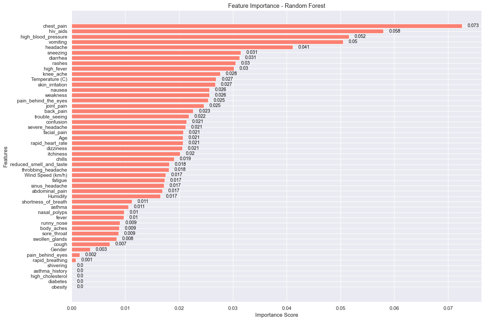
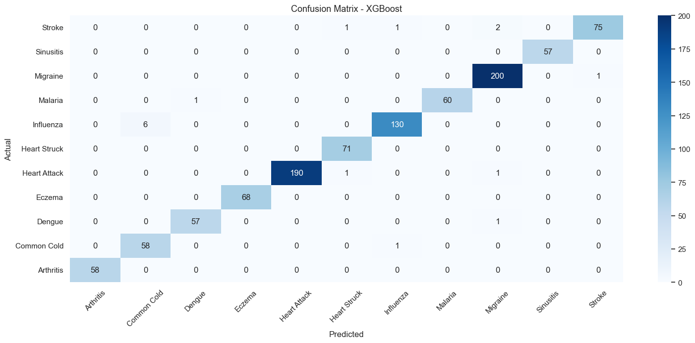
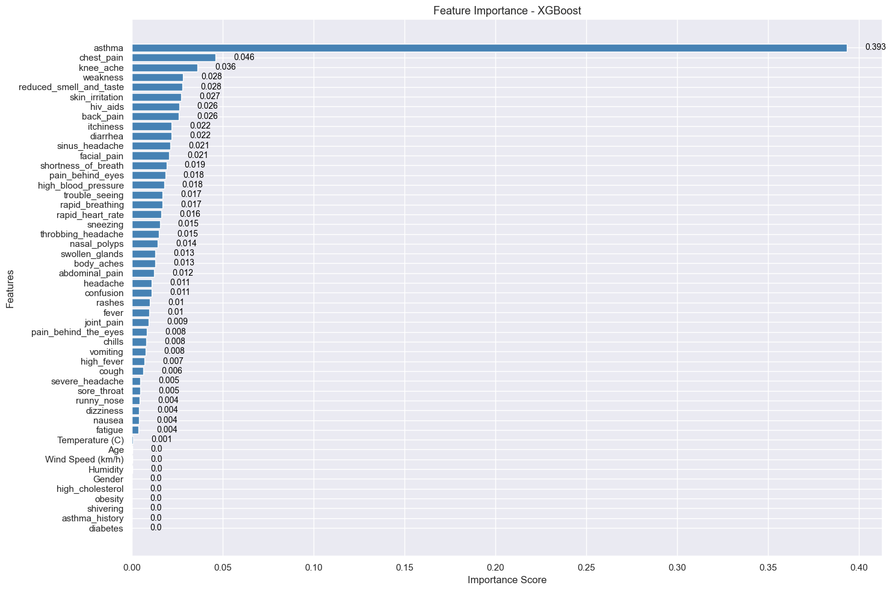

# Weather-Related Disease Prediction

## About Project
In this proeject we will be build the machine learning model to predicting the Weather-Related Disease datasets based on Prognosis variable on the data. The project including EDA (exploratory data analysis), building the model and tested, and evaluate the model. In order to make easy for the decision maker to take the decision, we also using two different model to explore the differences. 

## Project Outline
    ├── data/ # include raw data
    ├── notebooks/ # Notebook for EDA, Modelling and Evaluation
    ├── models/ # Model 
    └── README.md # Docomentation

## Datasets
This dataset integrates medical symptoms and weather conditions to facilitate research into the prediction of diseases influenced by meteorological factors. The data spans a range of weather parameters alongside reported medical symptoms from a sizable number of anonymized individuals.

[Source : https://www.kaggle.com/datasets/orvile/weather-related-disease-prediction-dataset/dat]

The data has:
* 5200 rows 
* 51 features
* Target variable = Prognosis (the only categorical data)

## Library
* pandas
* numpy
* scikit-learn
* xgboost
* seaborn
* matplotlib 
* joblib

## Model
There is two models that we use in this projects:

**1. Random Forest:**

    Accuracy : 98.5%
    CV : 98.1%
    Best parameter : {
        'max_depth': 30, 
        'max_features': 'sqrt', 
        'min_samples_leaf': 1, 
        'min_samples_split': 10, 
        'n_estimators': 200} 
    Accuracy Hypertuning : 98.3%

**2. XGBoost**

    Accuracy : 98.3%
    CV: 97.8%
    Best Parameters: {
        'colsample_bytree': 0.5, 
        'learning_rate': 0.2, 
        'max_depth': 5, 
        'n_estimators': 100, 
        'subsample': 1.0}
    Accuracy Hypertuning : 98.4%

## Evaluation 
Confusion Matrix - Random Forest

Feature Importance - Random Forest

Confusion Matrix - XGBoost

Feature Importance

## Conclusion
From the result that we have both models giving a high accuracy and not showing any major errors when trying to predict the target. The difference between both models is just the feature usage. On Random Forest, features are evenly used, but on XGBoost there is one feature that is more dominant than the others.

With this screnario we prefer to use the Random Forest model to predict, just because Random Forest has a slightly better accuracy and feature usage that helping the other feature not useless.
